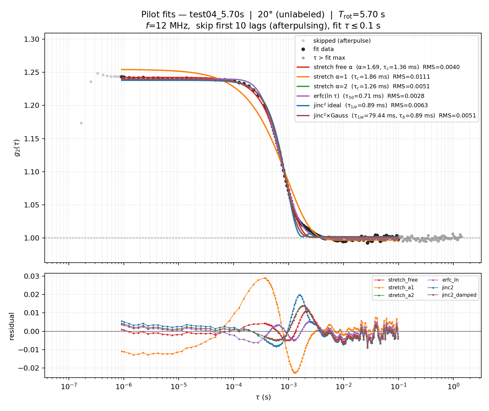
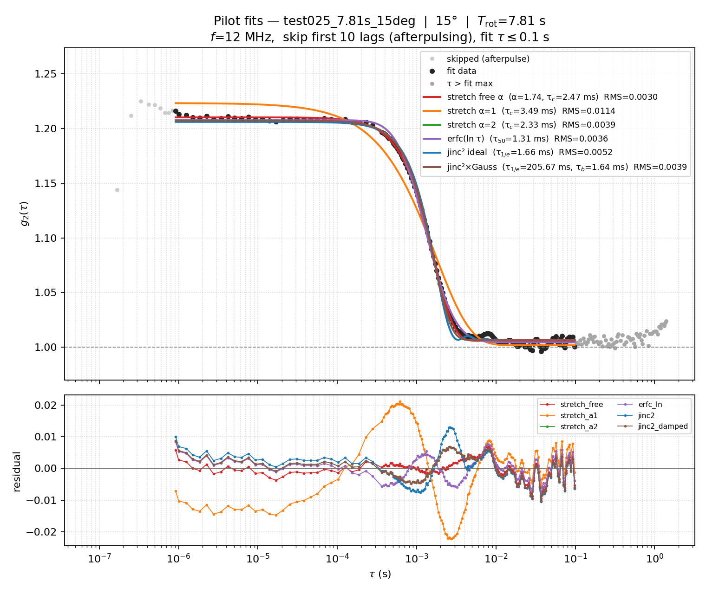

# Pilot curve-fit comparison

Models on the same log-τ axis:

1. Stretched exp (free α): \(g_2=C+\beta\exp[-2(\tau/\tau_c)^\alpha]\)
2. Same with α fixed to 1 and 2
3. Erfc-sigmoid in \(\ln\tau\): \(g_2=A\,\mathrm{erfc}((\ln\tau-B)/C_w)+D\)
4. Ideal jinc²: \(g_2=C+\beta[2J_1(a\tau)/(a\tau)]^2\), with \(a=\pi D\Omega\sin\theta/\lambda\)
5. jinc² × Gaussian envelope \(\exp[-(\tau/\tau_b)^2]\) (off-axis / boiling)

D_eff is recovered from the fitted \(a\) using the measured rotation period and nominal angle, with λ = 650 nm.

Skip first 10 lags (afterpulsing). Fit window: τ ≤ 0.1 s. Clock f = 12 MHz for these runs.

Equal weight per lag (lags already ~log-spaced).

### `test04_5.70s` — 20° (unlabeled), T_rot=5.7 s

| Model | contrast | char. time (ms) | shape | baseline | RMS |
|---|---|---|---|---|---|
| stretch free α | 0.2416 | τ_c=1.363 | α=1.690 | 1.0006 | 0.00398 |
| stretch α=1 | 0.2575 | τ_c=1.856 | α=1.000 | 0.9969 | 0.01108 |
| stretch α=2 | 0.2374 | τ_c=1.260 | α=2.000 | 1.0017 | 0.00506 |
| erfc(ln τ) | A=0.1202 | τ₅₀=0.713 | C_w=0.927 | 0.9993 | 0.00282 |
| jinc² ideal | 0.2359 | τ_1/e=0.894 | D_eff=1.175 mm | 1.0020 | 0.00632 |
| jinc²×Gauss | 0.2374 | τ_1/e=79.438 | D_eff=0.013 mm, τ_b=0.891 ms | 1.0017 | 0.00506 |

### `test025_7.81s_15deg` — 15°, T_rot=7.81 s

| Model | contrast | char. time (ms) | shape | baseline | RMS |
|---|---|---|---|---|---|
| stretch free α | 0.2044 | τ_c=2.474 | α=1.740 | 1.0058 | 0.00302 |
| stretch α=1 | 0.2215 | τ_c=3.491 | α=1.000 | 1.0018 | 0.01142 |
| stretch α=2 | 0.2007 | τ_c=2.325 | α=2.000 | 1.0066 | 0.00395 |
| erfc(ln τ) | A=0.1016 | τ₅₀=1.305 | C_w=0.937 | 1.0044 | 0.00364 |
| jinc² ideal | 0.1992 | τ_1/e=1.658 | D_eff=1.148 mm | 1.0068 | 0.00516 |
| jinc²×Gauss | 0.2007 | τ_1/e=205.672 | D_eff=0.009 mm, τ_b=1.644 ms | 1.0066 | 0.00395 |

